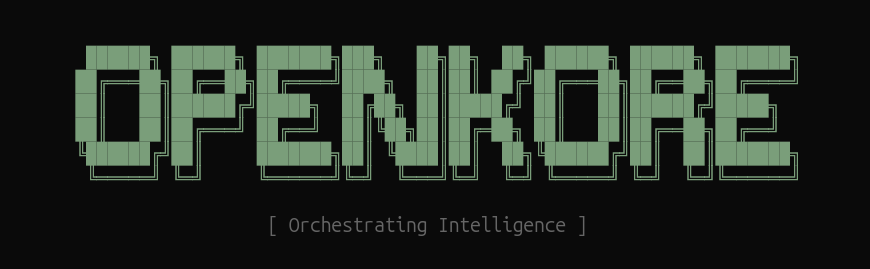
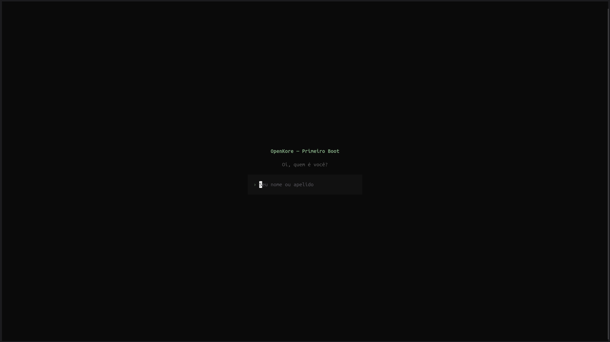
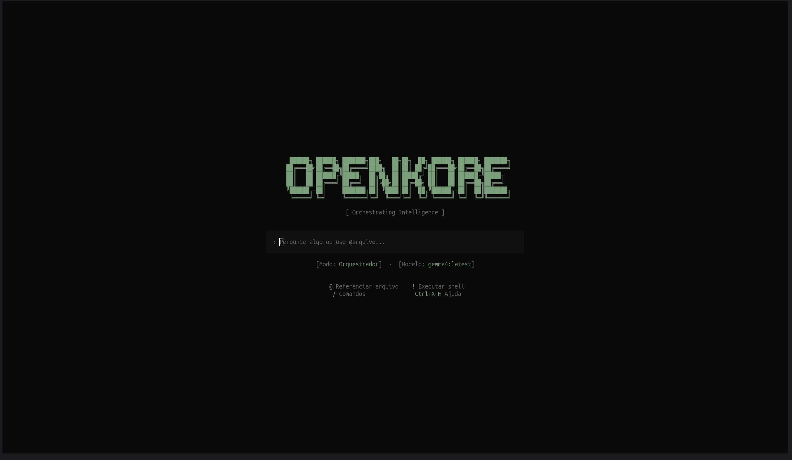
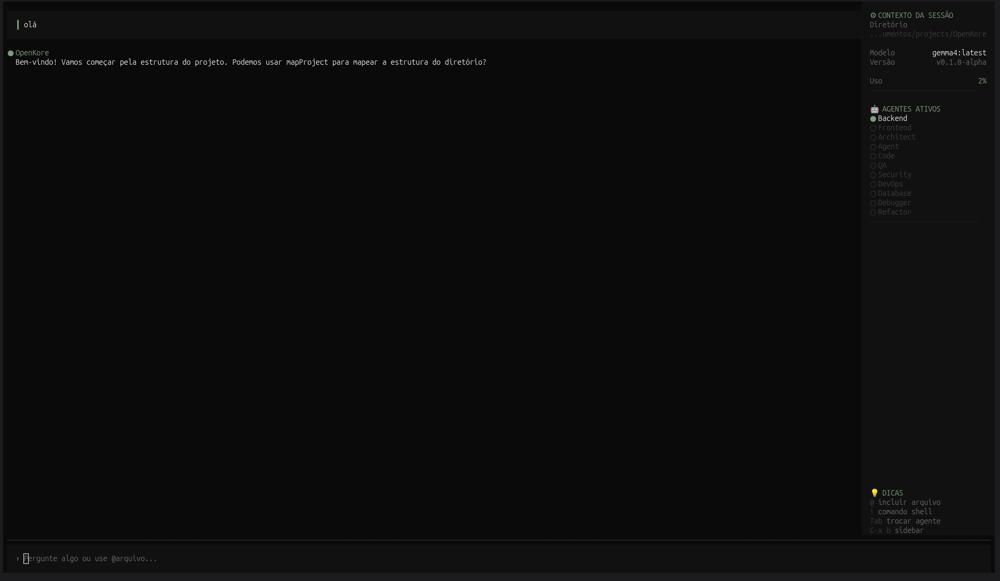

##

[English](README.md) | [Português (Brasil)](README.md) | [简体中文](README.md) | [日本語](README.md) | [한국어](README.md) | [Español](README.md)

---

**OpenKore** é um agente de IA 100% open source, escrito em TypeScript e otimizado para o runtime Bun. Ele oferece uma experiência de terminal rica (TUI) e uma arquitetura extensível de agentes para automação de desenvolvimento, análise de código e exploração de bases legadas.

## OpenKore Terminal UI

## Instalação

Em implementação.

## Agentes

O OpenKore inclui agentes especializados que você pode alternar usando a tecla `Tab`. Eles são divididos por domínios de expertise:

### 🛠️ Core Engineering
| Agente | Descrição | Modo |
| :--- | :--- | :--- |
| **backend** | Especialista em arquitetura de servidor, APIs e lógica de negócio. | Leitura + Escrita |
| **frontend** | Especialista em interfaces, componentes e experiência do usuário (UX). | Leitura + Escrita |
| **plan** | Arquiteto e planejador. Analisa o código e entrega planos acionáveis sem alterar nada. | Somente Leitura |
| **agent-builder** | Especializado em criar e configurar novos agentes para o seu projeto. | Leitura + Escrita |

### 🛡️ Quality & Safety
| Agente | Descrição | Modo |
| :--- | :--- | :--- |
| **reviewer** | Revisa código com foco em clareza, consistência e boas práticas. | Somente Leitura |
| **tester** | Especialista em QA: escreve testes unitários, integração e analisa cobertura. | Leitura + Escrita |
| **security** | Analista de segurança. Identifica vulnerabilidades e propõe mitigações. | Somente Leitura |

### 🏗️ Infrastructure & Data
| Agente | Descrição | Modo |
| :--- | :--- | :--- |
| **devops** | Especialista em CI/CD, containers, deploy e automação de pipelines. | Leitura + Escrita |
| **database** | Especialista em modelagem de dados, queries, migrações e otimização. | Leitura + Escrita |

### 🔧 Maintenance & Improvement
| Agente | Descrição | Modo |
| :--- | :--- | :--- |
| **debugger** | Especialista em diagnóstico de bugs e análise de causa raiz (root cause). | Leitura + Escrita |
| **refactor** | Focado em melhoria de código existente, legibilidade e redução de dívida técnica. | Leitura + Escrita |

> Além dos embutidos, você pode criar agentes personalizados em `.openkore/agents/` usando YAML ou TypeScript.

## Por que OpenKore?

- **100% Open Source:** Sem segredos, sem telemetria forçada, total transparência.
- **Provider-Agnostic:** Funciona com Claude, OpenAI, Google ou modelos locais via **Ollama** e **OpenRouter**.
- **Arquitetura Client/Server:** O servidor pode rodar remotamente enquanto você usa a TUI localmente.
- **Runtime Bun:** Startup instantâneo (< 50ms) e performance superior.
- **LSP Integrado:** Suporte nativo para compreensão profunda de símbolos e tipos.

## Documentação

Para mais detalhes sobre configuração, comandos e criação de agentes, visite nossa [Documentação Oficial](https://docs.openkore.ai).

## Contribuição

Interessado em ajudar? Leia nosso guia de [CONTRIBUTING.md](CONTRIBUTING.md) antes de enviar um Pull Request.

## Segurança

Segurança é prioridade. Veja nossa política em [SECURITY.md](SECURITY.md).

## FAQ

### O OpenKore é realmente gratuito?
Sim, o OpenKore é um software open source sob a licença MIT. O custo de uso depende inteiramente do modelo que você escolher. Se usar modelos locais via **Ollama**, o custo é zero. Se usar provedores como **OpenRouter**, **OpenAI** ou **Anthropic**, você pagará apenas pelo seu consumo de tokens diretamente ao provedor.

### Posso rodar o OpenKore 100% offline?
Sim! Ao configurar o OpenKore para usar o **Ollama** com modelos como `llama3` ou `qwen2.5-coder`, todo o processamento de IA acontece localmente na sua máquina. Nenhum código ou dado sai do seu ambiente, garantindo máxima privacidade.

### Como funcionam os Agentes Customizados?
O OpenKore foi desenhado para ser extensível. Você pode criar novos agentes simplesmente adicionando arquivos `.yaml` ou `.ts` no diretório `.openkore/agents/` do seu projeto. Isso permite criar especialistas em partes específicas do seu sistema ou em stacks proprietárias.

### O OpenKore suporta execução remota?
Sim. Graças à sua arquitetura **Client/Server**, o servidor do OpenKore pode rodar em uma máquina robusta (ou em um container) enquanto você interage através da TUI no seu terminal local. A comunicação é feita via uma API segura com suporte a streaming (SSE).

### O OpenKore pode danificar meu código?
Como qualquer agente que executa comandos e edita arquivos, o OpenKore deve ser usado com cautela. Agentes com permissão de escrita sempre solicitarão sua confirmação antes de executar comandos `bash` ou salvar alterações em arquivos. Recomendamos sempre revisar as mudanças e utilizar controle de versão (Git).

---

#### Inspirado no [OpenCode](https://opencode.ai/)
#### Feito com ❤️ por Thalisson Damião.

